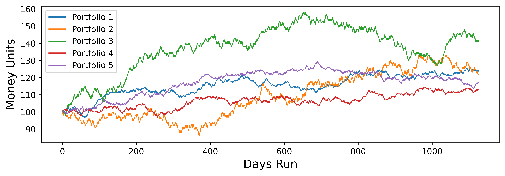

Portfolios rating and ranking
=============================
This example illustrates a hypothetical example for portfolios rating and ranking.
In this example, assume that there are three different investors.
First, there is an independent engineer, trading during his free time
and seeking some quick profit.
Next one is a start-up investment firm, in need of some profits, 
but also cautious of losses. Finally, a well-established investment fund,
concerned with the customer’s financial safety. 
We could say that the engineer is a risky investor (risk-lover), 
the start-up is neutral and the investment fund is a safe investor (risk-averse).
We rate the portfolios by applying rating aggregation methods.

.. note::

   For simplicity, we assume that the initial capital is 100 monetary units and each investor has to take into account three variables (attributes) that describe each portfolio: 

      * R2 (R2): measures the strength of the relationship between the portfolio and the movement
        of an index that we select as a benchmark. i.e. S&P 500. R2 ranges from 0 to 1. The highest value means that the portfolio performance can be explained better by the benchmark index.  
      * Average returns (Avg Return) : in this hypothetical example we examine average returns 
        between 0 to 0.4. 
      * Maximum drawdown (Max DD): the maximum losing period during the investment.
        Maximum Drawdown can range from 0 (perfect) to -1 (worst)

   Direct rating method (1..10) for weights: 
      * ENGINEER [RISK-SEEKING]: R2 4.0, AvgReturn 10.0, maxDD 4.0
      * STARTUP [NEUTRAL]: R2 10.0, AvgReturn 10.0, maxDD 10.0
      * FUND [RISK-AVERSE]: R2 10.0, AvgReturn 4.0, maxDD 10.0

   The logic of attributes imporatnce is explained as follows:
      * The engineer places more emphasis on the average profit.
      * The start-up is unbiased towards any of the attributes. 
      * The investment fund places more importance to the stability of the portfolios
   

.. rubric:: Portfolios’ Attributes
.. _label1:
.. csv-table::
   :file: ../../../../ratingslib/datasets/examples/portfoliosExample.csv
   :header-rows: 1

.. rubric:: Portfolios' Growth

.. toctree::
   notebooks/portfolios